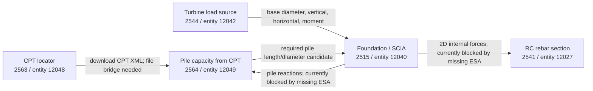

# VIKTOR Multi-App Workflow Analysis

Generated: 2026-05-18T17:09:01.610924+00:00

## Proposed workflow



## Edges

- `cpt_locator` -> `pile_capacity_cpt`: `candidate_file_bridge`
  - Mapping: `download_cpt_xml output -> tab_input.sec_file.cpt_file`
  - Note: The source produces a signed XML download. The downstream expects a VIKTOR file id, so the bridge needs a file upload/registration step.
- `turbine_load_source` -> `foundation_scia`: `proven_data_mapping`
  - Mapping: {"base_diameter": "step_geo.sec_mast.mast_diameter", "base_vert_force": "step_geo.sec_mast.mast_vertical_load", "base_horiz_force": "step_geo.sec_mast.mast_horizontal_load", "base_moment": "step_geo.sec_mast.mast_moment"}
- `foundation_scia` -> `pile_capacity_cpt`: `blocked_until_scia_results`
  - Mapping: `view_pile_reactions max compression -> tab_input.sec_load.design_load`
  - Note: Current SCIA result views fail because step_analysis.esa_file is null.
- `pile_capacity_cpt` -> `foundation_scia`: `candidate_iterative_update`
  - Mapping: {"req_length_item": "step_geo.sec_piles.pile_length", "diameter_item": "step_geo.sec_piles.pile_diameter"}
  - Note: This is an iterative sizing edge, not a simple one-way pipeline.
- `foundation_scia` -> `reinforced_concrete_section`: `blocked_until_scia_results`
  - Mapping: `view_2d_internal_forces envelopes -> tab_loading.combinations[].M_Ed/N_Ed`
  - Note: The rebar app is ready, but the upstream SCIA data is currently unavailable.

## App inspection

### cpt_locator

- URL: https://demo.viktor.ai/workspaces/2563/app/editor/12048
- Workspace/entity: `2563` / `12048`
- Entity name: `a7f8ebe1-dc4a-4756-ba32-ebbe47995600`
- Entity type id/name: `3921` / `Controller`
- Saved properties:
```json
{
  "location": {
    "lat": 51.9694,
    "lon": 5.0963
  },
  "min_depth": 20.0
}
```
- Input fields:
  - `location` (geo_point): Select location | default={"lat": 51.9694, "lon": 5.0963}
  - `min_depth` (number): Minimum depth | default=20
- Methods:
  - `map_view`: geojson_and_data_view / expected=geojson_and_data / label=Nearest CPT
  - `cpt_profile_view`: plotlyview / expected=plotly / label=📈 CPT Profile
  - `download_cpt_xml`: download_button / expected=download / label=⬇ Download CPT XML
- Probes:
  - `map_view`: status=`success`, kind=`data`
    - Flattened output keys:
      - `selected` = `51.96940, 5.09630`  (Selected location)
      - `nearest` = `CPT000000066733`  (Nearest CPT)
      - `distance` = `58.9` m (Distance)
      - `bro_id` = `CPT000000066733`  (BRO ID)
      - `registration_status` = `voltooid`  (Registration status)
      - `accountable_party` = `50200097`  (Accountable party)
      - `research_date` = `2013-06-25`  (Research date)
      - `final_depth` = `34.774 m`  (Final depth)
      - `quality_class` = `klasse2`  (Quality class)
      - `cpt_standard` = `NEN5140`  (CPT standard)
      - `cone_surface_area` = `1000 mm2`  (Cone surface area)
      - `cone_surface_quotient` = `0.75`  (Cone surface quotient)
  - `download_cpt_xml`: status=`success`, kind=`download`
    - Download: {'url_present': True, 'host': 'viktor-storage-eu1.s3.amazonaws.com', 'url_redacted': '[signed download url omitted]'}

### pile_capacity_cpt

- URL: https://demo.viktor.ai/workspaces/2564/app/editor/12049
- Workspace/entity: `2564` / `12049`
- Entity name: `Calculation 1`
- Entity type id/name: `3922` / `Controller`
- Saved properties:
```json
{
  "tab_input": {
    "sec_file": {
      "cpt_file": 20631
    },
    "sec_pile": {
      "pile_tip_level": -17,
      "pile_diameter": 0.5,
      "pile_shape": "Round",
      "pile_type": "Bored pile",
      "surface_level": -0.88
    },
    "sec_load": {
      "design_load": 1100
    }
  }
}
```
- Input fields:
  - `tab_input.sec_file.cpt_file` (file): Upload BRO CPT XML file | default=null
  - `tab_input.sec_pile.pile_tip_level` (number): Pile tip level | default=-17
  - `tab_input.sec_pile.pile_diameter` (number): Pile diameter / width | default=0.4
  - `tab_input.sec_pile.pile_shape` (select): Pile cross-section | default="Round"
  - `tab_input.sec_pile.pile_type` (select): Pile type | default="Bored pile"
  - `tab_input.sec_pile.surface_level` (number): Surface level (ground level) | default=-0.88
  - `tab_input.sec_load.design_load` (number): Required compressive pile load (Fc;d) | default=1100
- Methods:
  - `view_cpt`: plotlyview / expected=plotly / label=CPT Profile
  - `view_results`: dataview / expected=data / label=Bearing Capacity Results
  - `view_depth_curve`: plotlyview / expected=plotly / label=Bearing Capacity vs. Depth
  - `view_required_depth`: dataview / expected=data / label=Required Pile Depth
- Probes:
  - `view_results`: status=`success`, kind=`data`
    - Flattened output keys:
      - `pile_type_item` = `Bored pile`  (Pile type)
      - `pile_shape_item` = `Round`  (Cross-section)
      - `diameter_item` = `0.5` m (Diameter / width)
      - `length_item` = `16.12` m (Pile length)
      - `tip_item` = `-17` m NAP (Pile tip level)
      - `alpha_p_item` = `0.5`  (αp (tip factor))
      - `qc_tip_item` = `9.55` MPa (qc;tip (4D–8D average))
      - `xi3_item` = `1.33`  (ξ3 (correlation factor))
      - `rb_cal` = `937.9` kN (Rb;cal (base resistance))
      - `rs_cal` = `802.2` kN (Rs;cal (shaft resistance))
      - `rc_cal` = `1740.2` kN (Rc;cal (total characteristic))
      - `rc_d` = `1090.3` kN (Rc;d (design value))
      - `fc_d` = `1100` kN (Fc;d (applied design load))
      - `util` = `1.009`  (Utilisation Fc;d / Rc;d)
  - `view_required_depth`: status=`success`, kind=`data`
    - Flattened output keys:
      - `fc_d_item` = `1100` kN (Required load Fc;d)
      - `pile_type_item` = `Bored pile`  (Pile type)
      - `diameter_item` = `0.5` m (Diameter / width)
      - `req_length_item` = `16.25` m (Required pile length)
      - `req_Rcd_item` = `1107.2` kN (Rc;d at required depth)
      - `req_Rb_item` = `946.6` kN (Rb;cal at required depth)
      - `req_Rs_item` = `820.5` kN (Rs;cal at required depth)

### turbine_load_source

- URL: https://demo.viktor.ai/workspaces/2544/app/editor/12042
- Workspace/entity: `2544` / `12042`
- Entity name: `Turbine selector workflow copy`
- Entity type id/name: `3906` / `Controller`
- Saved properties:
```json
{
  "turbine_model": "Siemens Gamesa SG 5.0-145"
}
```
- Input fields:
  - `turbine_model` (select): Turbine model | default="Vestas V150-4.5 MW"
- Methods:
  - `view_turbine_data`: dataview / expected=data / label=Turbine Parameters
  - `view_schematic`: plotlyview / expected=plotly / label=Turbine Schematic
  - `view_comparison`: plotlyview / expected=plotly / label=Turbine Comparison
- Probes:
  - `view_turbine_data`: status=`success`, kind=`data`
    - Flattened output keys:
      - `capacity` = `5` MW (Rated capacity)
      - `hub_height` = `105` m (Hub height)
      - `base_diameter` = `4.2` m (Base diameter)
      - `base_moment` = `155925` kNm (Max. moment at base)
      - `base_horiz_force` = `1485` kN (Max. horizontal force at base)
      - `base_vert_force` = `3973` kN (Max. vertical force at base)
      - `rna_weight` = `110` t (Rotor-Nacelle Assembly (RNA))
      - `tower_weight` = `295` t (Tower)
      - `total_weight` = `405` t (Total turbine weight)

### foundation_scia

- URL: https://demo.viktor.ai/workspaces/2515/app/editor/12040
- Workspace/entity: `2515` / `12040`
- Entity name: `Agent bridge from Agent sibling smoke 2026-05-17T22:08:42 - Turbine 1 2026-05-17T22:53:06Z`
- Entity type id/name: `3878` / `Controller`
- Saved properties:
```json
{
  "step_geo": {
    "sec_mast": {
      "mast_diameter": 4.2,
      "mast_vertical_load": 3973,
      "mast_horizontal_load": 1485,
      "mast_moment": 155925
    },
    "sec_slab": {
      "slab_diameter": 20,
      "slab_thickness": 3
    },
    "sec_piles": {
      "num_piles": 30,
      "pile_length": 20,
      "pile_diameter": 500,
      "pile_edge_distance": 600
    }
  },
  "step_geo_tech": {
    "sec_tip": {
      "tip_stiffness": 50000
    },
    "sec_lateral": {
      "lateral_stiffness": 10000
    }
  },
  "step_analysis": {
    "esa_file": null
  }
}
```
- Input fields:
  - `step_geo.sec_mast.mast_diameter` (number): Mast diameter | default=5
  - `step_geo.sec_mast.mast_vertical_load` (number): Vertical Force | default=4000
  - `step_geo.sec_mast.mast_horizontal_load` (number): Horizontal Force | default=1500
  - `step_geo.sec_mast.mast_moment` (number): Overturning Moment | default=150000
  - `step_geo.sec_slab.slab_diameter` (number): Slab diameter | default=20
  - `step_geo.sec_slab.slab_thickness` (number): Slab thickness | default=3
  - `step_geo.sec_piles.num_piles` (integer): Number of piles | default=30
  - `step_geo.sec_piles.pile_length` (number): Pile length | default=20
  - `step_geo.sec_piles.pile_diameter` (number): Pile diameter | default=500
  - `step_geo.sec_piles.pile_edge_distance` (number): Edge distance (slab edge → pile centre) | default=600
  - `step_geo_tech.sec_tip.tip_stiffness` (number): Axial spring stiffness at pile tip | default=50000
  - `step_geo_tech.sec_lateral.lateral_stiffness` (number): Horizontal spring stiffness (per unit length) | default=10000
  - `step_analysis.esa_file` (file): SCIA template (.esa) | default=null
- Methods:
  - `view_geometry`: geometry_view / expected=geometry / label=3D Geometry
  - `view_results`: dataview / expected=data / label=Results Summary
  - `view_pile_reactions`: tableview / expected=table / label=Pile Reactions
  - `view_2d_internal_forces`: tableview / expected=table / label=2D Internal Forces
  - `view_mxd_plus_plot`: plotlyview / expected=plotly / label=2D Moment Contour Plots
  - `download_scia_input_xml`: download_button / expected=download / label=Download SCIA input XML
  - `download_scia_input_def`: download_button / expected=download / label=Download SCIA .def file
- Probes:
  - `view_results`: status=`failed`, kind=`None`
  - `view_pile_reactions`: status=`failed`, kind=`None`
  - `view_2d_internal_forces`: status=`failed`, kind=`None`

### reinforced_concrete_section

- URL: https://demo.viktor.ai/workspaces/2541/app/editor/12027
- Workspace/entity: `2541` / `12027`
- Entity name: `Section 1`
- Entity type id/name: `3903` / `Controller`
- Saved properties:
```json
{
  "tab_geometry": {
    "width": 1000,
    "height": 3000,
    "cover": 30,
    "stirrup_dia": 8,
    "spacing_bottom": 100,
    "dia_bottom": 32,
    "spacing_top": 200,
    "dia_top": 32
  },
  "tab_loading": {
    "concrete_class": "C25/30",
    "steel_grade": "B500",
    "combinations": [
      {
        "label": "LC1",
        "M_Ed": -4085.95,
        "N_Ed": 0
      },
      {
        "label": "LC2",
        "M_Ed": 7483.99,
        "N_Ed": 51.73
      }
    ]
  },
  "tab_optimise": {
    "spacing_min": 50
  }
}
```
- Input fields:
  - `tab_geometry.width` (number): Width | default=1000
  - `tab_geometry.height` (number): Height | default=3000
  - `tab_geometry.cover` (number): Clear cover | default=50
  - `tab_geometry.stirrup_dia` (number): Stirrup diameter | default=10
  - `tab_geometry.spacing_bottom` (number): Centre-to-centre spacing | default=200
  - `tab_geometry.dia_bottom` (select): Bottom bar diameter | default=25
  - `tab_geometry.spacing_top` (number): Centre-to-centre spacing | default=200
  - `tab_geometry.dia_top` (select): Top bar diameter | default=16
  - `tab_loading.concrete_class` (select): Concrete class | default="C25/30"
  - `tab_loading.steel_grade` (select): Steel grade | default="B500"
  - `tab_loading.combinations` (DynamicArray): Load Combinations | default=[{"M_Ed": -1000, "N_Ed": -100, "label": "LC1"}, {"M_Ed": 3000, "N_Ed": 100, "label": "LC2"}]
  - `tab_optimise.spacing_min` (number): Minimum allowed spacing | default=50
- Methods:
  - `view_cross_section`: plotlyview / expected=plotly / label=Cross-Section
  - `view_mn_diagram`: plotlyview / expected=plotly / label=M-N Interaction Diagram
  - `view_results`: dataview / expected=data / label=Results
  - `view_optimise`: dataview / expected=data / label=Optimise Reinforcement
  - `apply_optimised_params`: button / expected=None / label=Optimize Reinforcement
- Probes:
  - `view_results`: status=`success`, kind=`data`
    - Flattened output keys:
      - `width` = `1000` mm (Width b)
      - `height` = `3000` mm (Height h)
      - `cover` = `30` mm (Clear cover)
      - `n_bot` = `9`  (Bottom bars)
      - `A_s` = `7238` mm² (Bottom steel A_s)
      - `n_top` = `5`  (Top bars)
      - `A_s2` = `4021` mm² (Top steel A_s2)
      - `rho` = `0.375` % (Total ρ)
      - `d` = `2946` mm (Effective depth d)
      - `M_Ed_item` = `7483.99` kNm (M_Ed)
      - `N_Ed_item` = `51.73` kN (N_Ed)
      - `x_item` = `122.1` mm (Neutral axis x)
      - `M_Rd_item` = `9184.47` kNm (M_Rd)
      - `UC_item` = `0.815`  (Unity check M_Ed / M_Rd)
  - `view_optimise`: status=`success`, kind=`data`
    - Flattened output keys:
      - `spc_item` = `120` mm (Spacing ctc (top & bottom))
      - `dia_bot_item` = `32` mm (Bottom bar diameter)
      - `n_bot_item` = `8`  (Number of bottom bars)
      - `As_bot_item` = `6434` mm² (Bottom steel area A_s,bot)
      - `dia_top_item` = `25` mm (Top bar diameter)
      - `n_top_item` = `8`  (Number of top bars)
      - `As_top_item` = `3927` mm² (Top steel area A_s,top)
      - `rho_item` = `0.345` % (Total reinforcement ratio ρ)
      - `m_ed` = `7483.99` kNm (M_Ed)
      - `n_ed` = `51.73` kN (N_Ed)
      - `m_rd` = `8186.32` kNm (M_Rd)
      - `uc` = `0.914`  (Unity check M_Ed / M_Rd)

## Blockers

- `foundation_scia.step_analysis.esa_file` is null. SCIA result methods are blocked until an `.esa` template is uploaded or otherwise made available.
- Because of that, `view_pile_reactions`, `view_results`, and `view_2d_internal_forces` currently fail.
- `cpt_locator.download_cpt_xml` returns a signed XML download URL. To feed `pile_capacity_cpt.tab_input.sec_file.cpt_file`, the bridge still needs a VIKTOR file upload/registration step that returns a file id.

## Generic propagation rule

1. Re-read every entity before each run.
2. Build downstream params as `defaults + latest saved entity properties`.
3. Re-run upstream output methods.
4. Apply only validated mappings.
5. Preserve downstream-only fields.
6. Log blocked branches and continue independent branches.

## Bridge code skeleton

```python
from __future__ import annotations

import json
import os
import time
from copy import deepcopy
from typing import Any

import requests

TOKEN = (os.getenv("TOKEN_VK_APP") or os.getenv("VIKTOR_TOKEN") or "").strip()
if not TOKEN:
    raise RuntimeError("Set TOKEN_VK_APP or VIKTOR_TOKEN.")


class ViktorClient:
    def __init__(self, api_base: str) -> None:
        self.api_base = api_base.rstrip("/")
        self.headers = {"Authorization": f"Bearer {TOKEN}"}
        self.json_headers = {**self.headers, "Content-Type": "application/json"}

    def get(self, path_or_url: str, params: dict[str, Any] | None = None) -> Any:
        url = path_or_url if path_or_url.startswith("http") else f"{self.api_base}/{path_or_url.lstrip('/')}"
        response = requests.get(url, headers=self.headers, params=params, timeout=(5, 120))
        response.raise_for_status()
        return response.json()

    def post(self, path: str, payload: dict[str, Any] | None = None) -> Any:
        response = requests.post(
            f"{self.api_base}/{path.lstrip('/')}",
            headers=self.json_headers,
            json=payload or {},
            timeout=(5, 120),
        )
        response.raise_for_status()
        return response.json()

    def entity_properties(self, workspace_id: int, entity_id: int) -> dict[str, Any]:
        entity = self.get(
            f"workspaces/{workspace_id}/entities/{entity_id}/",
            params={"properties": "true", "clean_params": "true", "param_types": "true"},
        )
        return entity.get("properties") or {}

    def run_method(
        self,
        workspace_id: int,
        entity_id: int,
        method_name: str,
        params: dict[str, Any],
        max_seconds: int = 180,
    ) -> dict[str, Any]:
        created = self.post(
            f"workspaces/{workspace_id}/entities/{entity_id}/jobs/",
            {
                "method_name": method_name,
                "params": params,
                "poll_result": False,
                "timeout": 86400,
            },
        )
        if not created.get("url"):
            return created
        deadline = time.monotonic() + max_seconds
        while time.monotonic() < deadline:
            job = self.get(created["url"])
            if job.get("status") in {"success", "failed", "cancelled", "error", "error_user", "error_timeout"}:
                return job
            time.sleep(1.0)
        raise TimeoutError(f"{method_name} did not finish in {max_seconds}s")


def deep_merge(base: dict[str, Any], overlay: dict[str, Any]) -> dict[str, Any]:
    result = deepcopy(base)
    for key, value in (overlay or {}).items():
        if isinstance(value, dict) and isinstance(result.get(key), dict):
            result[key] = deep_merge(result[key], value)
        else:
            result[key] = deepcopy(value)
    return result


def flatten_data_items(items: list[dict[str, Any]]) -> dict[str, dict[str, Any]]:
    out: dict[str, dict[str, Any]] = {}

    def visit(item: dict[str, Any], group: str | None = None) -> None:
        children = item.get("children") or []
        next_group = item.get("key") or item.get("label") or group if children else group
        if not children and item.get("key"):
            out[str(item["key"])] = {
                "group": group,
                "label": item.get("label"),
                "value": item.get("value"),
                "unit": item.get("suffix") or "",
            }
        for child in children:
            visit(child, next_group)

    for item in items:
        visit(item)
    return out


API = "https://demo.viktor.ai/api"
client = ViktorClient(API)

TURBINE = {"workspace_id": 2544, "entity_id": 12042}
FOUNDATION = {"workspace_id": 2515, "entity_id": 12040}
PILE_CAPACITY = {"workspace_id": 2564, "entity_id": 12049}
REBAR = {"workspace_id": 2541, "entity_id": 12027}


def build_foundation_from_turbine() -> dict[str, Any]:
    turbine_params = client.entity_properties(**TURBINE)
    turbine_job = client.run_method(**TURBINE, method_name="view_turbine_data", params=turbine_params)
    turbine_data = flatten_data_items((turbine_job.get("result") or {}).get("data") or [])

    foundation_params = client.entity_properties(**FOUNDATION)
    foundation_params.setdefault("step_geo", {}).setdefault("sec_mast", {})
    mast = foundation_params["step_geo"]["sec_mast"]
    mast["mast_diameter"] = turbine_data["base_diameter"]["value"]
    mast["mast_vertical_load"] = turbine_data["base_vert_force"]["value"]
    mast["mast_horizontal_load"] = turbine_data["base_horiz_force"]["value"]
    mast["mast_moment"] = turbine_data["base_moment"]["value"]
    return foundation_params


def run_workflow() -> dict[str, Any]:
    log: list[dict[str, Any]] = []
    foundation_params = build_foundation_from_turbine()

    if not foundation_params.get("step_analysis", {}).get("esa_file"):
        log.append({
            "node": "foundation_scia",
            "status": "blocked",
            "reason": "Missing step_analysis.esa_file. SCIA result methods cannot produce pile reactions or internal forces yet.",
            "prepared_params": foundation_params,
        })
        return {"status": "partial", "log": log}

    reactions = client.run_method(**FOUNDATION, method_name="view_pile_reactions", params=foundation_params)
    reaction_data = flatten_data_items((reactions.get("result") or {}).get("data") or [])
    # TODO: choose the exact max compression key from the real pile reaction table/data.
    max_compression_kn = max(
        value["value"]
        for value in reaction_data.values()
        if isinstance(value.get("value"), (int, float))
    )

    pile_params = client.entity_properties(**PILE_CAPACITY)
    pile_params.setdefault("tab_input", {}).setdefault("sec_load", {})["design_load"] = max_compression_kn
    pile_job = client.run_method(**PILE_CAPACITY, method_name="view_required_depth", params=pile_params)
    pile_data = flatten_data_items((pile_job.get("result") or {}).get("data") or [])

    foundation_params.setdefault("step_geo", {}).setdefault("sec_piles", {})
    foundation_params["step_geo"]["sec_piles"]["pile_length"] = pile_data["req_length_item"]["value"]

    internal_forces = client.run_method(**FOUNDATION, method_name="view_2d_internal_forces", params=foundation_params)
    # TODO: map real force envelope rows once the SCIA view succeeds.
    rebar_params = client.entity_properties(**REBAR)
    rebar_params.setdefault("tab_loading", {})["combinations"] = [
        {"label": "SCIA envelope +", "M_Ed": 0, "N_Ed": 0},
        {"label": "SCIA envelope -", "M_Ed": 0, "N_Ed": 0},
    ]
    rebar_job = client.run_method(**REBAR, method_name="view_optimise", params=rebar_params)

    return {
        "status": "success",
        "foundation_params": foundation_params,
        "pile_capacity": pile_job.get("status"),
        "internal_forces": internal_forces.get("status"),
        "rebar": rebar_job.get("status"),
        "log": log,
    }


if __name__ == "__main__":
    print(json.dumps(run_workflow(), indent=2, default=str))
```
